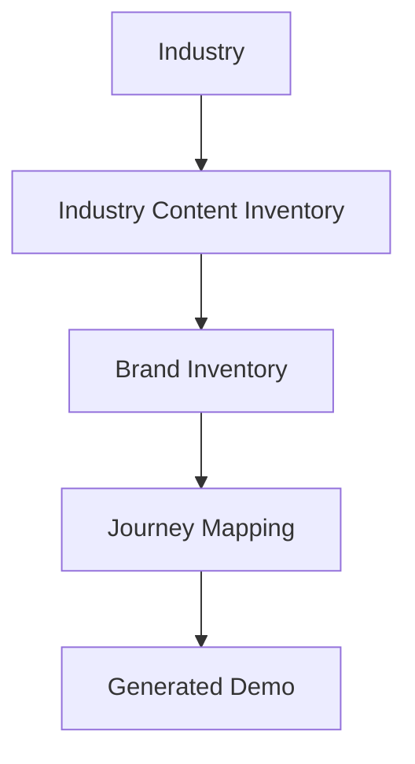
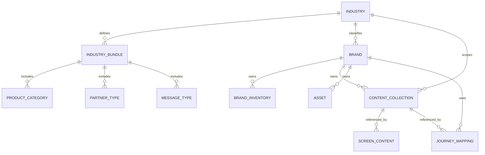

# Industry Content Inventory System - Design Spec

**Date:** 2026-06-02  
**Project:** ZoTok Demo Generator (`@zotok/demo-generator`)  
**Status:** Approved

## Goal

Design an industry-first content inventory system for demo journeys. The system must define reusable business content before any brand is created, then let each brand fill only the values that belong to that brand. Journeys consume content from the inventory; journeys do not own business content.

This is a content architecture only.

## Non-Goals

- ERP design
- CRM design
- Transaction processing systems
- Accounting, tax, credit, warehouse, or operational database design
- UI implementation details
- Rendering engine changes

## Design Summary

The platform should follow this flow:



Industry determines the available business vocabulary, entity types, content groups, and reusable message patterns. Brand inventory then fills the selected industry inventory with brand-specific values such as names, logos, product lists, and campaign content. Journeys only reference inventory records and render them in screens.

## Principles

1. Industry first: content structure begins with industry, not brand.
2. Inventory before journey: define reusable content once, then map it into journeys.
3. Business-user editable: users should edit content in business terms, not technical terms.
4. Reusable by design: avoid copy duplication across screens and journeys.
5. Safe brand separation: content must be scoped so one brand cannot contaminate another.
6. Screen-agnostic: screen definitions consume content collections; they do not hardcode copy.

## Information Model

The system uses four layers:

1. `Industry` - defines the content vocabulary for a business domain.
2. `Brand Inventory` - fills industry-defined slots with brand-specific values.
3. `Content Inventory` - reusable content groups and templates.
4. `Screen Content` - mapped content atoms used by journey screens.

## 1. Industry Inventory Model

The industry inventory defines what content exists before a brand is selected.

### Industry Schema

| Field | Type | Purpose |
|---|---|---|
| `id` | string | Stable industry key such as `building_materials` |
| `name` | string | Display name |
| `description` | string | High-level industry summary |
| `status` | string | `active`, `draft`, `deprecated` |
| `productCategories` | array | Allowed product families |
| `productAttributes` | array | Standard attributes per product category |
| `partnerTypes` | array | Allowed business partner roles |
| `transactionTypes` | array | Allowed content-bearing business events |
| `messageTypes` | array | Reusable communication intents |
| `terminology` | object | Industry vocabulary and synonym map |
| `metrics` | array | Standard business measures surfaced in journeys |
| `assetTypes` | array | Allowed asset classes |
| `campaignTypes` | array | Standard campaign families |
| `contentTypes` | array | Reusable content collections supported by the industry |
| `screenContentTypes` | array | Content slots that screens can request |
| `metadata` | object | Ownership, versioning, tags |

### Industry Inventory Details

#### Product Categories

Defines the kinds of products that may exist in that industry.

Examples:
- Building Materials: Cement, Putty, Tile Adhesive
- Pharma: Tablet, Syrup, Injection
- FMCG: Biscuits, Namkeen, Sweets
- Steel: TMT Bar, Coil, Sheet
- Stationery & Books: Notebook, Pen, Textbook

Each category can declare:
- allowed attributes
- allowed units
- packing conventions
- stock or volume naming patterns
- optional compliance labels

#### Product Attributes

Defines the normalized attributes that content editors may fill for products.

Recommended attribute groups:
- identity: `name`, `shortName`, `sku`, `brandLine`
- packaging: `packSize`, `unit`, `variantName`
- commercial: `mrp`, `tradePrice`, `schemeText`
- classification: `category`, `subCategory`, `tags`
- visual: `image`, `packShot`, `heroAsset`
- compliance: `warnings`, `legalText`, `expiryText`

#### Partner Types

Defines the role vocabulary for the industry.

Examples:
- Building Materials: Dealer, Retailer, Contractor, Mason
- Pharma: Stockist, Chemist, Doctor, Medical Representative
- FMCG: Distributor, Retailer, Salesman
- Steel: Dealer, Fabricator, Contractor
- Stationery & Books: Distributor, Retailer, Institution Buyer

Each partner type can define:
- label
- plural label
- allowed screen appearances
- allowed message templates
- required profile fields

#### Transaction Types

This is a content classification layer only. It names the business events that produce message text or screen content.

Examples:
- Order Confirmation
- Order Update
- Invoice Shared
- Payment Received
- Collection Reminder
- Shipment Update
- Scheme Applied
- Expiry Alert
- Loyalty Earned

#### Message Types

Standard message intents that can be reused across journeys.

Examples:
- Greeting
- Order Confirmation
- Payment Reminder
- Collection Follow-up
- Campaign Announcement
- Loyalty Reward
- Product Launch
- Expiry Notification
- Help Prompt
- Success Message
- Error Message

#### Terminology

A controlled vocabulary for industry-specific words and synonym mappings.

Examples:
- `dealer` -> `stockist` in some contexts
- `salesman` -> `field executive`
- `order` -> `indent` in some industries
- `retailer` -> `shop`

This supports copy consistency across screens, labels, and messages.

#### Metrics

Defines which measures may appear in dashboards and summary blocks.

Examples:
- total orders
- active dealers
- pending collections
- loyalty points
- schemes redeemed
- products viewed
- campaign responses

#### Asset Types

Defines the content assets that the industry expects.

Examples:
- logo
- product image
- banner
- brochure
- sticker
- icon
- flyer
- campaign creative

#### Campaign Types

Defines campaign families that may be created for the industry.

Examples:
- stock refill
- launch announcement
- loyalty scheme
- festive promotion
- collection nudge
- educational campaign

#### Content Types

Defines reusable content collections that can be assembled into journeys and screens.

Examples:
- greetings
- notifications
- order messages
- collection messages
- campaign messages
- loyalty messages
- dashboard content
- help content
- educational content
- success messages
- error messages

## 2. Industry Bundle Model

An industry bundle is a packaged inventory preset. It is the starting point for a brand in that industry.

### Bundle Structure

| Field | Type | Purpose |
|---|---|---|
| `industryId` | string | Parent industry |
| `bundleId` | string | Bundle key |
| `name` | string | Display name |
| `version` | string | Bundle version |
| `includedCategories` | array | Product categories |
| `includedPartnerTypes` | array | Partner roles |
| `includedMessageTypes` | array | Message intents |
| `includedContentTypes` | array | Reusable content sets |
| `includedAssetTypes` | array | Asset classes |
| `includedCampaignTypes` | array | Campaign families |
| `defaultTerminology` | object | Default vocabulary |
| `defaultMetrics` | array | Default dashboard measures |
| `notes` | string | Bundle guidance |

### Bundle Examples

#### FMCG

- Product categories: Biscuits, Namkeen, Sweets, Beverages
- Partner types: Distributor, Retailer, Salesman
- Message types: Scheme Notification, Stock Refill Reminder, Order Confirmation
- Content types: greetings, notifications, campaign messages, loyalty messages
- Asset types: product packshot, promo banner, campaign flyer

#### Pharma

- Product categories: Tablet, Syrup, Injection, Ointment
- Partner types: Stockist, Chemist, Doctor, Medical Representative
- Message types: Expiry Alert, Product Launch, Prescription Availability
- Content types: help content, educational content, notification, success/error messages
- Asset types: packshot, insert leaflet, compliance banner

#### Building Materials

- Product categories: Cement, Putty, Tile Adhesive, Wall Care
- Partner types: Dealer, Retailer, Contractor, Mason
- Message types: Order Confirmation, Collection Reminder, Loyalty Reward
- Content types: order messages, collection messages, dashboard content, campaign content
- Asset types: bag image, product image, dealer banner, scheme flyer

#### Steel

- Product categories: TMT Bar, Coil, Sheet, Pipe
- Partner types: Dealer, Fabricator, Contractor, Project Buyer
- Message types: Order Confirmation, Dispatch Update, Payment Reminder
- Content types: notifications, operational updates, help content, dashboard content
- Asset types: product image, mill certificate, campaign banner

#### Stationery & Books

- Product categories: Notebook, Pen, Textbook, Exam Guide
- Partner types: Distributor, Retailer, Institution Buyer
- Message types: Stock Refill Reminder, Order Confirmation, Campaign Notification
- Content types: educational content, campaign content, loyalty content, greetings
- Asset types: cover image, product image, brochure, classroom poster

### Bundle Rule

Industry bundles may differ in:
- vocabulary
- partner roles
- product categories
- approved message types
- campaign families
- asset sets

They must not differ in structural shape. Every bundle must still expose the same core schema so the platform remains consistent.

## 3. Brand Inventory

After industry selection, the brand inventory only contains user-editable values. It does not redefine the industry structure.

### Brand Inventory Schema

| Field | Type | Purpose |
|---|---|---|
| `brandId` | string | Stable brand key |
| `industryId` | string | Selected industry |
| `brandName` | string | Display brand name |
| `logo` | object | Brand logo asset references |
| `brandColors` | object | Color palette |
| `products` | array | Brand product entries |
| `partners` | array | Brand partner entries |
| `campaigns` | array | Brand campaign entries |
| `messages` | array | Brand message overrides and variants |
| `assets` | array | Brand-owned assets |
| `locale` | string | Language/locale preference |
| `tone` | string | Brand communication tone |
| `metadata` | object | Ownership, status, tags |

### Brand Inventory Rules

- Only editable fields live here.
- All values must inherit the industry bundle structure.
- A brand may override labels and examples, but not the industry’s base content model.
- If the same product or message is reused across journeys, it should remain a single brand inventory record.

## 4. Content Inventory

Content inventory is the reusable content layer used by journeys and screens.

### Content Inventory Schema

| Field | Type | Purpose |
|---|---|---|
| `id` | string | Stable content key |
| `brandId` | string | Owning brand |
| `industryId` | string | Owning industry |
| `type` | string | Content collection type |
| `name` | string | Human-readable name |
| `description` | string | Purpose of the content set |
| `items` | array | Individual content entries |
| `variants` | array | Optional alternate versions |
| `usageScope` | array | Allowed screens/journeys/channels |
| `tone` | string | Voice style |
| `locale` | string | Language/locale |
| `status` | string | `draft`, `active`, `archived` |
| `metadata` | object | Tags, owner, version |

### Core Content Collections

#### Greetings

Used in welcome screens and opening messages.

Suggested fields:
- `title`
- `body`
- `audience`
- `channel`
- `tone`

#### Notifications

Used for generic alerts, updates, and system prompts.

Suggested fields:
- `eventType`
- `headline`
- `body`
- `cta`
- `severity`

#### Order Messages

Used when a journey references order-related business text.

Suggested fields:
- `header`
- `summary`
- `lineItemHint`
- `confirmationText`
- `statusText`

#### Collection Messages

Used for payment reminders and collection follow-up content.

Suggested fields:
- `header`
- `dueHint`
- `followUpText`
- `escalationText`
- `cta`

#### Campaign Messages

Used for promotions, launches, schemes, and seasonal offers.

Suggested fields:
- `campaignName`
- `headline`
- `body`
- `benefitText`
- `cta`

#### Loyalty Messages

Used for points, tiers, rewards, and redemption content.

Suggested fields:
- `pointsText`
- `tierText`
- `rewardText`
- `redeemText`

#### Dashboard Content

Used in overview tiles and summary cards.

Suggested fields:
- `sectionTitle`
- `metricLabel`
- `emptyState`
- `helperText`

#### Help Content

Used in support, onboarding, and explanation screens.

Suggested fields:
- `question`
- `answer`
- `tip`
- `contactPrompt`

#### Educational Content

Used for product education, scheme education, and feature explainers.

Suggested fields:
- `topic`
- `summary`
- `keyPoints`
- `learnMoreCta`

#### Success Messages

Used after completion states.

Suggested fields:
- `headline`
- `body`
- `nextStep`
- `cta`

#### Error Messages

Used when validation or screen actions fail.

Suggested fields:
- `headline`
- `body`
- `retryCta`
- `supportHint`

## 5. Screen Content Model

Screen content is a presentation layer that consumes content inventory records.

### Screen Content Schema

| Field | Type | Purpose |
|---|---|---|
| `screenId` | string | Screen key |
| `brandId` | string | Owning brand |
| `journeyId` | string | Journey reference |
| `contentRefs` | object | References to reusable content inventory |
| `header` | object | Header content reference |
| `subHeader` | object | Sub header reference |
| `description` | object | Description reference |
| `cta` | object | CTA reference |
| `emptyState` | object | Empty state reference |
| `successState` | object | Success state reference |
| `errorState` | object | Error state reference |
| `footer` | object | Footer reference |
| `metadata` | object | Version, status, overrides |

### Screen Slot Rules

- `header` should carry the primary message for the screen.
- `subHeader` should support context or orientation.
- `description` should explain action, benefit, or next step.
- `cta` should be a reusable action label.
- `emptyState` should explain absence of data or action.
- `successState` should confirm completion.
- `errorState` should explain failure and recovery.
- `footer` should hold disclaimers, help text, or support links.

### Screen Consumption Pattern

1. Screen requests its slot map.
2. Slot map points to content collection entries.
3. Journey renders those entries without rewriting the copy.
4. Brand-specific text appears only through references and overrides.

## 6. Relationships



### Relationship Rules

- Industry defines the allowable universe.
- Brand inventory fills the industry-defined universe.
- Content collections are reusable across screens.
- Screen content references collections; it does not duplicate them.
- Journey mapping only binds inventory to screens and steps.

## 7. JSON Examples

### Industry

```json
{
  "id": "building_materials",
  "name": "Building Materials",
  "description": "Content inventory for cement, hardware, and site-focused sales journeys",
  "status": "active",
  "productCategories": [
    { "id": "cement", "name": "Cement" },
    { "id": "putty", "name": "Putty" },
    { "id": "tile_adhesive", "name": "Tile Adhesive" }
  ],
  "partnerTypes": [
    { "id": "dealer", "name": "Dealer" },
    { "id": "retailer", "name": "Retailer" },
    { "id": "contractor", "name": "Contractor" },
    { "id": "mason", "name": "Mason" }
  ],
  "messageTypes": [
    { "id": "order_confirmation", "name": "Order Confirmation" },
    { "id": "collection_reminder", "name": "Collection Reminder" },
    { "id": "loyalty_reward", "name": "Loyalty Reward" }
  ],
  "terminology": {
    "dealer": ["dealer", "stockist"],
    "retailer": ["retailer", "shop"],
    "order": ["order", "booking"]
  },
  "metrics": [
    { "id": "pending_collections", "name": "Pending Collections" },
    { "id": "active_dealers", "name": "Active Dealers" }
  ],
  "assetTypes": [
    { "id": "product_image", "name": "Product Image" },
    { "id": "campaign_banner", "name": "Campaign Banner" }
  ],
  "campaignTypes": [
    { "id": "stock_refill", "name": "Stock Refill" },
    { "id": "festive_promo", "name": "Festive Promotion" }
  ],
  "contentTypes": [
    { "id": "order_messages", "name": "Order Messages" },
    { "id": "collection_messages", "name": "Collection Messages" }
  ]
}
```

### Brand Inventory

```json
{
  "brandId": "jk_cement",
  "industryId": "building_materials",
  "brandName": "JK Cement",
  "logo": {
    "assetId": "asset_logo_jk_cement",
    "label": "Primary logo"
  },
  "brandColors": {
    "primary": "#0E4C8A",
    "secondary": "#F5F7FA",
    "accent": "#D81E05"
  },
  "products": [
    {
      "id": "prod_jk_super_cement",
      "name": "JK Super Cement",
      "sku": "JKC-001",
      "categoryId": "cement",
      "packSize": "50kg",
      "unit": "bag"
    }
  ],
  "partners": [
    {
      "id": "partner_shree_traders",
      "typeId": "dealer",
      "displayName": "Shree Traders"
    }
  ],
  "campaigns": [
    {
      "id": "cmp_monsoon_saver",
      "typeId": "festive_promo",
      "name": "Monsoon Saver"
    }
  ],
  "messages": [
    {
      "id": "msg_order_confirmation_001",
      "typeId": "order_confirmation",
      "channel": "whatsapp"
    }
  ],
  "assets": [
    {
      "id": "asset_prod_jk_super_cement",
      "typeId": "product_image"
    }
  ]
}
```

### Content Collection

```json
{
  "id": "collection_order_messages_jk_cement",
  "brandId": "jk_cement",
  "industryId": "building_materials",
  "type": "order_messages",
  "name": "Order Messages",
  "description": "Reusable order-related copy for the brand",
  "items": [
    {
      "id": "order_header",
      "label": "Header",
      "text": "Your order is confirmed"
    },
    {
      "id": "order_cta",
      "label": "CTA",
      "text": "View Order"
    }
  ],
  "usageScope": ["order_to_cash", "retailer_onboarding"],
  "tone": "business-friendly",
  "locale": "en-IN",
  "status": "active"
}
```

### Screen Content

```json
{
  "screenId": "order_confirmation_screen",
  "brandId": "jk_cement",
  "journeyId": "order_to_cash",
  "contentRefs": {
    "header": "collection_order_messages_jk_cement.order_header",
    "cta": "collection_order_messages_jk_cement.order_cta",
    "successState": "collection_success_messages_jk_cement.success_001"
  },
  "header": {
    "ref": "collection_order_messages_jk_cement.order_header"
  },
  "subHeader": {
    "text": "Dealer and retailer confirmation copy"
  },
  "description": {
    "text": "Shown after a completed order action."
  },
  "cta": {
    "ref": "collection_order_messages_jk_cement.order_cta"
  },
  "emptyState": {
    "text": "No order details available."
  },
  "successState": {
    "ref": "collection_success_messages_jk_cement.success_001"
  },
  "errorState": {
    "text": "Unable to load order content."
  },
  "footer": {
    "text": "Contact support if the order summary looks incorrect."
  }
}
```

## 8. Journey Mapping

Journey mapping links content inventory to a flow without taking ownership of the content.

### Journey Mapping Schema

| Field | Type | Purpose |
|---|---|---|
| `journeyId` | string | Journey key |
| `brandId` | string | Owning brand |
| `industryId` | string | Owning industry |
| `screenMappings` | array | Screen-to-content references |
| `contentReferences` | array | Inventory references used by the journey |
| `metadata` | object | Version, status, owner |

### Mapping Rule

A journey may choose:
- which content collection to use
- which screen slot to bind
- which terminology variant to display
- which assets to show

A journey may not:
- redefine the industry bundle
- duplicate master content
- own business terminology outside its mapping layer

## 9. Admin UI Structure

The editing experience should be organized around business vocabulary.

### Suggested Sections

- Industry Setup
- Industry Bundles
- Brand Inventory
- Product Library
- Partner Library
- Content Library
- Message Templates
- Assets
- Screen Content
- Journey Mapping

### Editing Rules

- Industry admins define the bundle first.
- Brand users fill only brand-owned inventory fields.
- Content editors manage reusable collections and message variants.
- Journey editors bind existing content to screens.

## 10. Migration Strategy

The current system likely has copy embedded in screen files and journey JSON. Migration should extract content into the new inventory layer in stages.

### Migration Steps

1. Inventory all hardcoded business terms, labels, products, partners, and messages.
2. Group duplicate phrases into reusable content collections.
3. Create industry bundles for each active industry.
4. Move product and partner names into brand inventory.
5. Move repeated screen copy into screen content references.
6. Replace hardcoded journey text with inventory references.
7. Keep only presentation glue inside journeys.

### Migration Rules

- One real-world product should map to one product inventory record.
- Reused labels should be promoted to terminology or content collections.
- Screen-specific static text should become screen content.
- Brand-specific variants should live in brand inventory, not inside journeys.

## 11. Governance

### Ownership

- Industry model: platform owner
- Brand inventory: brand admin or business editor
- Content collections: content editor or marketing admin
- Journey mappings: demo builder or journey editor

### Validation

Before publishing, validate:
- required industry fields exist
- brand inventory references valid industry types
- no journey contains duplicated master content
- no content collection crosses brand scope
- screen slots have valid references or approved fallback text

## 12. Success Criteria

- The same industry bundle can seed multiple brands without schema changes.
- Business users can edit products, partners, messages, and assets without journey edits.
- Journeys consume content by reference instead of ownership.
- Screen content is consistent across journeys and easier to localize.
- New industries can be added by extending the inventory, not by redesigning the platform.

